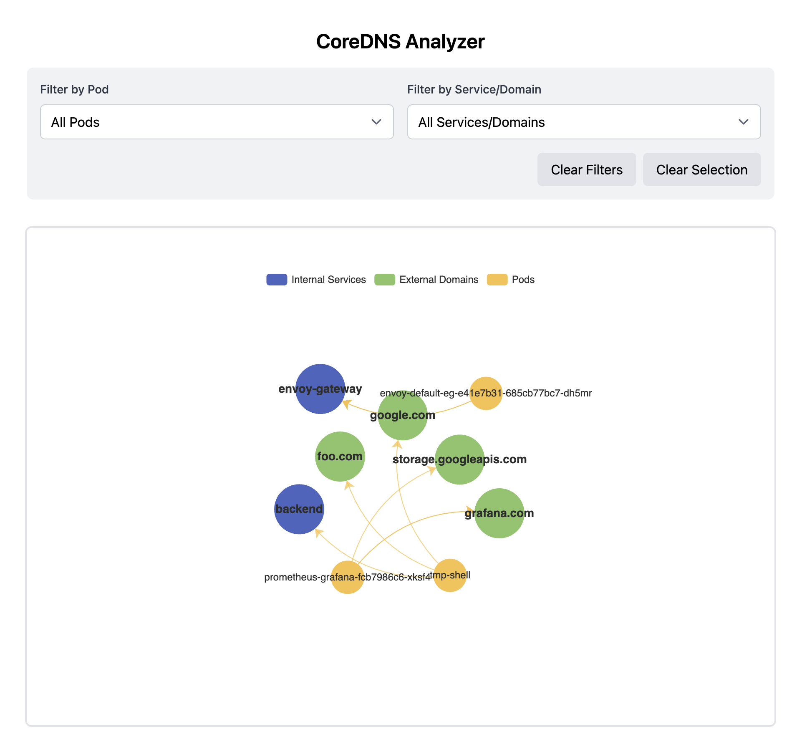

# CoreDNS Analyzer
A tool to analyze and visualize DNS communication patterns in Kubernetes clusters by monitoring CoreDNS logs. Built with Rust and Vue.js.



## Features

- Real-time monitoring of CoreDNS pod logs
- Interactive graph visualization of DNS queries
- Differentiation between internal (k8s services) and external DNS requests
- Pod and service-based filtering
- WebSocket-based live updates

## Architecture

- Backend: Rust service watching CoreDNS logs via Kubernetes API
- Frontend: Vue.js application with ECharts visualization
- Communication: WebSocket connection for real-time updates

## Requirements

- Kubernetes cluster with CoreDNS
- Rust compiler
- Modern web browser

## Usage

### Configure CoreDNS Logging


1. Get current ConfigMap:
```bash
kubectl get configmap coredns -n kube-system -o yaml > coredns-cm.yaml
```

2. Apply the updated ConfigMap: 
```bash
apiVersion: v1
kind: ConfigMap
metadata:
  name: coredns
  namespace: kube-system
data:
  Corefile: |
    .:53 {
        errors
        log . {
            class all # Add this line
        }
        health
        kubernetes cluster.local in-addr.arpa ip6.arpa {
           pods insecure
           fallthrough in-addr.arpa ip6.arpa
        }
        forward . /etc/resolv.conf
        cache 30
        loop
        reload
        loadbalance
    }
```

3. Apply the updated ConfigMap: 
```bash
kubectl apply -f coredns-cm.yaml
````

4. Start the analyzer and open the web interface (default port 8080) to see a real-time graph of DNS communication patterns in your cluster. Filter by specific pods or services to focus on particular communication paths.

```bash
cargo run
```